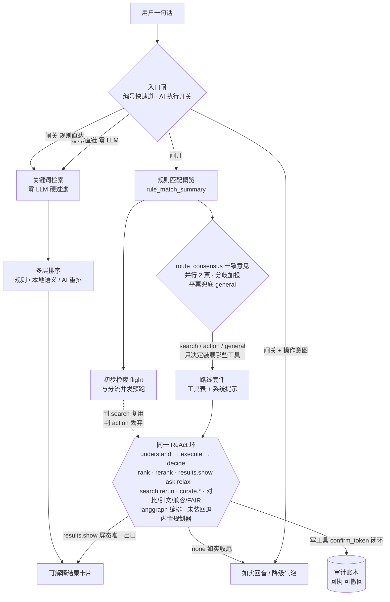

# BioData Agent

[](https://github.com/hty8870/biodata-agent/actions/workflows/ci.yml)
[](LICENSE)
[](requirements/requirements.txt)

**中文** · [English](README_EN.md)

面向公开单细胞与空间组学数据集目录的**对话式数据发现 Agent**：用一句中文描述实验需求，系统在 8,022 条公开数据集元数据上完成硬过滤、可解释排序、引文与下载整理。架构上以 **ReAct 为执行主环、RAG 为检索核**；规则检索默认离线且不消耗 token，本地向量与 LLM 是可选增强。工具面按当前任务收窄，独立只读调用可安全批处理；每次调用都留下执行上下文、证据与回执，全程**可审计、可回退**。


## 为什么是 BioData Agent

### 低延迟：默认路径零 LLM

- 规则检索全程确定性、离线、无需 API Key——本机实测端到端约 24ms，对话路由的关键词计数段 p50=16ms（n=30）。
- 整库目录 API（8,022 条）：gzip 后 0.87MB（10.9%），缓存命中中位 17ms，ETag 304 约 22ms。
- 冷启动到健康检查约 1.1s；语料与索引懒加载，import 期零 I/O。
- 本地向量召回/重排为 opt-in：权重预下载、运行时不联网；AI 重排、推荐说明润色、AI 执行均为可选增强，缺席时诚实回退并如实标注，绝不静默改变行为。

> 上述延迟为本机实测值，用于相对验证，不作为跨硬件 SLA。

### 安全性：写盘是例外，不是常态

- 19 个 MCP 工具中只有 3 个能写盘，且全部**两步确认**：plan 阶段零写盘、返回预览与 `confirm_token`（动作参数+内容指纹的 sha256），token 不符一个字节都不写。
- 冻结评测基准库结构性只读：上传、下载、trace 全部锚定在外部库与用户数据目录，`database/base/` 无从触碰。
- 下载通道 SSRF 全防线：https+域名白名单、每跳重定向重新校验、连接钉死已校验 IP（防 DNS rebinding）、拒绝回环/私网/云元数据地址（169.254.169.254 等）、限 3 跳、流式字节硬上限超限即断。
- API Key 默认只活在本会话内存，落盘需双重显式勾选；自定义 LLM 端点过同样的 IP 校验，且不继承服务端共享 Key。
- 账号 scrypt+随机盐、恒时比较、防枚举/防时序旁路、失败短时锁定；在线 MCP 的 Bearer 令牌只存 sha256 摘要（泄库不泄可用凭证），且持令牌者**无法烧服务端 LLM 账单**（contextvar 级强制成本闸）。
- 部署口径如实写在 [SECURITY.md](SECURITY.md)：loopback 默认配置不等于生产就绪，遥测接收端点是已备案的明文 HTTP 风险接受项，公网暴露请按其清单加固。

### 可审计：每次调用都留下完整现场

- 每次工具调用附着完整执行信息与执行背景，写入仅追加的 trace 事件账本（seq 连续 JSONL，入口校验可序列化）。
- 联网请求账本（含失败与重试次数）、operation receipt、MCP 调用脱敏留痕（`.userdata/mcp_calls.jsonl`）、检索配置指纹随每次响应返回。
- 遥测本地优先：行为记录默认只存本机；上传需「开关 + 每个账户独立明示同意」双门控；查询词、追踪名等内容字段结构性不进遥测。

### 可回退：任何写操作都有后悔药

- 删除是**移入回收站**（可随时恢复），不是真删；回退动作本身也走回收站，无 preimage 一律 fail-closed 拒动。
- 同步更新**整次可撤回**：按 operation_id 批量回滚该次全部写入，回收站语义、可重入、状态诚实。
- 确认前预览、`dry_run` 预演；下载先写 `.part` 再原子改名，核验不过改 `.corrupt` 留证据而不覆盖。
- 无 LLM / 无本地模型 / 无网络：降级为规则路径并如实标注来源；查无此物只给放宽建议，不拿不满足硬条件的数据凑数。

### 检索质量：可验证，不是口号

| 评测 | 规模 | Top1 | Top5 | 硬条件违规 | 说明 |
|---|---:|---:|---:|---:|---|
| 冻结主集（唯一发布门） | 54 题 | 97.7% | 97.7% | 0 | FASTQ 违规 0；「无结果」题 10/10 正确弃权 |
| 盲建 holdout（泛化看门狗） | 50 题 | 97.8% | 97.8% | 0 | 构建者全程未见检索实现与主集条目 |

- 演进轨迹（全部有受控重基线记录）：Top1 71.8% → 97.7%，Top5 79.5% → 97.7%，硬违规 37.7% → 0。
- 纪律本身就是产品：冻结语料 SHA-256 指纹锁（CRLF/LF 免疫）；阈值只能收紧、调高视同放宽门须记录授权；private holdout 单次使用、不公开，禁止据其回改实现后邀功。public 提供 frozen、dev 与独立 public-validation 输入，可离线复现公开质量门；holdout 指标只作为注明来源的历史私有证据。

### 工程可信度

- 质量政策钉住“当前套件全部通过”，不手填会随提交漂移的 passed 数量；CI 保留对应 commit 的机器可读报告。
- public full 为 11 门：依赖一致性、全量测试、项目/Web/MCP 三端冒烟、冻结+dev 评测和安装包契约；private 在此基础上另加治理门与私有 holdout，共 13 门。
- CI 三腿矩阵（Windows full + Ubuntu 双 Python 版本 fast）、三平台源码包首启冒烟、交付面防污扫描源头拦截内部材料。

## 界面

| 智能查询 | 检索结果 | 继续对话 |
|---|---|---|
|  |  |  |

## 架构速览



两条面共用同一套语料（冻结基准 + 外部库）与同一套确定性生成器；任一 AI 环节不可用都诚实回退。「AI 执行」开启时，一句话先在环首做一致意见分流（多温度并行投票，平票机械兜底 general）——分流只决定本回合装载哪套工具与系统提示，随后永远进入同一个 ReAct 环自主多步执行；规则检索 flight 与分流并发预跑，判为检索即复用该结果、判为工具调用则丢弃，路由不空等检索。

## 快速开始

### Windows：双击启动

1. 确认电脑已安装 Python 3.10 或更高版本。
2. 双击项目根目录的 `打开前端.bat`，也可以双击 `start-web.bat`。
3. 首次运行会自动准备项目专用 `.venv`、按需安装运行依赖，并打开浏览器；不会静默借用开发或 MCP 环境。
4. 页面地址默认为 <http://127.0.0.1:7860>。

> 仓库克隆说明：交付包/便携包内启动脚本与依赖清单仍在包根目录（包内布局不变）；**仓库克隆**里启动脚本在 `launchers/`、依赖清单在 `requirements/`、MCP 入口在 `src/dataset_recommender/app/mcp_server.py`。快速开始一节面向交付包用户按包内路径书写；后文开发与排障章节的命令按仓库克隆路径书写。

首次安装依赖需要网络，以后启动复用本项目的 `.venv`。如确需共享解释器，须用 `BIODATA_PYTHON` 显式指定；临时改端口用 `$env:PORT = '7861'`。

### macOS / Linux：一键启动

```bash
sh 打开前端.sh        # Linux / 通用；macOS 也可直接双击「打开前端.command」
```

首次运行会自动准备并复用项目内 `.venv`、按需安装依赖、用英文问三个可选问题（全可回车跳过），然后自动打开浏览器；端口被占会自动漂移到 7861-7869。若 macOS 提示“来自身份不明的开发者”，右键 → 打开，或先 `chmod +x 打开前端.command`。

### 手动启动

```powershell
# Windows PowerShell（macOS/Linux 换成 python3 与 ./.venv/bin/python）
python -m venv .venv
.\.venv\Scripts\python.exe -m pip install -r requirements\requirements.txt
.\.venv\Scripts\python.exe scripts\run_web.py --open
```

### 桌面窗口模式（可选）

想要「原生应用」手感（独立窗口、无浏览器界面）时：

```powershell
.\.venv\Scripts\python.exe -m pip install -r requirements\requirements-webview.txt   # 一次即可（pywebview 5.4）
.\.venv\Scripts\python.exe scripts\run_app.py                          # 原生窗口，关窗即退出
```

窗口底色/尺寸/图标与应用一致；外部链接在系统浏览器打开；壳不可用（缺 pywebview / 缺 WebView2 / 建窗失败）时优雅回退到系统浏览器 + 托盘，绝不白屏。安装版（Inno 打包的 `BioDataAgent.exe`）默认已是窗口模式；直接双击裸 exe 仍走浏览器 + 托盘作为恢复通道。调试开关 `BIODATA_SHELL_DEBUG=1` 可在窗口内打开 DevTools。

### 平台支持

| 平台 | 支持形态 | 说明 |
|---|---|---|
| Windows | 桌面窗口 App（WebView2）+ 安装器；也可浏览器访问 | 双击 `start-web.bat` 或安装版启动；桌面形态含托盘、单实例、本地通知 |
| macOS / Linux | 源码起服务 + 任意现代浏览器 | 界面是同一套网页，全部功能与 Windows 一致；不提供原生窗口、安装器与托盘 |

账户与本地数据（收藏、历史、上传）保存在各自机器上，不同设备之间互不同步。

#### 企业代理环境

在必须经代理出网的企业内网中：LLM 调用、数据集管护（curate 联网搜）与遥测上传走标准 `HTTP_PROXY`/`HTTPS_PROXY`；**下载执行器为防 SSRF 钉目标 IP 直连、绕过代理**——「只有代理能出网」的内网里服务端代下会失败，属预期行为，此时请把下载脚本拿到能直连外网的机器执行。

### 网页版（Docker 部署）

带账号体系、邀请码注册、在线 MCP 令牌与遥测接收端的网页版镜像见 `deploy/web/`（compose + 部署脚本，README 模板化可自建）。

## 功能地图

- **对话式数据库管护**：一句话清点 / 本地导入（内容 hash 去重）/ 联网搜官方源 / 回收站式删除 / 恢复 / 检查并同步官方源更新。管护对象仅限你上传的 `upload_*` 文件，全部写动作两步确认、可整次撤回。开启「AI 执行」（默认开）后操作类指令直接替你办掉，每一步写入本机审计账本；安装 langchain 扩展（`requirements/requirements-langchain.txt`）后执行层改由 langgraph 编排的 Agent 接管，未装或未配大模型自动回退内置规划器（功能一致）。
- **统一下载通道**：一切浏览器下载（真实数据文件 / 引文 / 任务包 / 导出）只走一个下载队列，状态机诚实（「已交给浏览器」就是已交给浏览器），面板可追加、可取消未发射项。
- **一句话任务包**：一次检索 → 结果清单 + 下载脚本 + FAIR 自检 + 引文四件套，先预览、确认后产包。
- **FAIR 复用就绪度检查**：13 项 F/A/I/R 检查 + 可入稿件的英文声明，确定性离线、不调 LLM。
- **引文三格式导出**：RIS / BibTeX / GB/T 7714-2015 [DS/OL] 数据集著录，缺字段如实列 gaps 不编造。
- **追踪与检查更新**：满意的检索现场一键「存为追踪」（只存本机浏览器）；「检查更新」用当初的条件确定性重跑，新数据集先进「待核验」，绝不自动纳入；导出中心可产出纳入排除表与研究材料包。
- **账号与记忆**：注册/登录、会话 30 天、邀请码制（护栏部署）、账号级 LLM 日配额（BYOK 不计费）；「用户记忆」手动保存、可逐条删除，不会自动拼入查询；「整理记忆」由 LLM 在封闭护栏内产出、逐字出处核验、人工勾选才写入，产出恒标「AI 整理」。服务端另有可选的 Redis 会话后端与 RQ 任务队列后端（均默认关闭，见 deploy/web/README.md §10）。
- **使用反馈**：本地采集默认开启（消息、结果、耗时、报错、评分），不采集 API Key、密码和账户名；只有部署方配置了安全遥测通道才会脱敏上传，默认空配置只存本地、可手动导出、可随时关闭或清空。

## 基本使用流程

1. 在“智能查询”中输入实验需求，例如：
   - `推荐近三年 CELLxGENE 中的人类肝脏单细胞数据`
   - `找有 FASTQ 的小鼠脑 scRNA-seq 数据`
   - `2015 年以来的人类乳腺癌数据，不要空间转录组`
2. 保持“数据来源”和“发表时间”为“自动识别”，系统会从查询中提取对应条件；也可以展开后手动选择。
3. 看结果上方的检索摘要：它写明系统识别出了哪些条件、用了哪几层排序、库中共匹配多少条，以及有没有哪一层因不可用而改用了基础方式。
4. 打开结果卡片查看数据集来源、匹配理由、页面链接和文件清单；点击“数据集详情”会在新标签页打开该数据集的详情页。

首次进入页面会显示 14 步新手教程，可拖动、可跳过，之后能在“帮助”里重新打开。教程第 5 步会展开真实的 API 配置表单；不想现在配置可直接跳过，基础检索仍然可用。

## 排序策略

- **规则排序**：始终启用。先硬条件过滤，再按确定性规则排序。
- **本地精准重排**：本地语义模型调整候选顺序，不需要 API Key；模型未安装时自动回退规则排序。
- **AI 重排**：调用已配置的 LLM 调整通过硬过滤的候选顺序，需要网络和 API Key。
- **AI 润色推荐说明**：只改善表达，不改变数据和排序。

默认开启“自动选择排序策略”，系统按查询复杂度决定是否叠加本地或 AI 重排；规则排序始终保留。AI 与本地语义重排只调整候选顺序，明确的物种、组织、疾病、技术、时间和原始数据条件始终由规则过滤负责。

## 数据范围

当前内置语料包含 8,022 条公开数据集元数据。用户上传后总数会相应增加。

| 来源 | 当前记录数 |
|---|---:|
| 10x Genomics | 784 |
| CELLxGENE Discover | 2,198 |
| ArrayExpress | 1,784 |
| HuBMAP | 1,016 |
| Broad Single Cell Portal | 830 |
| Human Cell Atlas | 532 |
| EBI Single Cell Expression Atlas | 384 |
| refine.bio | 300 |
| Zenodo | 94 |
| NCBI GEO | 60 |
| ENCODE | 40 |

数据分为两层：`database/base/` 是随项目提供、带 SHA-256 指纹锁的 10x Genomics 冻结基准（稳定检索与评测）；`database/external/` 是其他公开来源快照与用户上传数据，只有明确选择相应来源时才参与推荐。

项目处理的是数据集元数据（标题、物种、组织、疾病、技术、发布日期、公开 URL 和文件清单），不包含生物序列、私有临床原始数据或湿实验操作方案。

## 上传自己的数据集

网页端进入“数据集浏览”，在页面顶部上传 UTF-8 JSON 文件。上传内容只写入 `database/external/`，不会覆盖基础库；成功后无需重启即可浏览和检索。最小示例：

```json
[
  {
    "dataset_name": "Human lung single-cell atlas",
    "species": "Human",
    "tissue": "lung"
  }
]
```

完整字段、来源优先级、批量格式和删除方法见[数据集上传规范](使用教程/数据集上传/数据集上传规范.md)。

## API 与 LLM 配置

不配置 API 也能使用规则检索和已安装的本地语义模型。网页端配置：打开“设置” → 展开“AI / API 配置” → 可直接选择 DeepSeek、Kimi、Qwen、GLM、OpenRouter 或 OpenAI（自动填入官方兼容地址和推荐模型），未单列的服务用“兼容接口”，本地部署选“本地模型”。

API Key 默认只在当前页面会话中使用；只有同时开启“记住非敏感设置”和“也记住 API Key”后，Key 才会写入当前浏览器的本地存储。旧版本遗留但没有这项独立授权的 Key 会在载入设置时自动清除。不要在共享电脑上保存个人 Key。

服务端也可以使用项目根目录的本地 `.env`（复制 `.env.example` 填写；`.env` 已被 Git 忽略）。配置优先级：进程环境变量、`BIODATA_LLM_ENV_FILE` 指向的外部配置文件、项目 `.env` 或 `.env.zhipu`、程序默认值。MCP 场景建议使用项目外密钥文件，详见[MCP 安装、API 配置与验收教程](使用教程/MCP安装/MCP_安装教程.md)。

## 本地语义模型

本地精准重排依赖额外模型，模型权重不会随提交包分发。安装版在安装器中提供可选「本地模型」任务（默认不勾）；源码包可手工安装：

```powershell
$Python = '.\.venv\Scripts\python.exe'   # macOS/Linux 换成 ./.venv/bin/python
& $Python -m pip install -r requirements\requirements-embeddings.txt
& $Python scripts\fetch_embedding_model.py
```

未安装模型不会阻止项目启动，系统会回退到规则排序。

## 命令行使用

```powershell
$Python = '.\.venv\Scripts\python.exe'   # macOS/Linux 换成 ./.venv/bin/python
& $Python src\dataset_recommender\app\cli.py --query '推荐有 FASTQ 的人类乳腺癌数据' --strategy auto --no-llm --show-pipeline
```

常用参数：`--top-k N`、`--strategy fixed|auto`、`--recall off|cross_encoder|dense`、`--rerank off|llm`、`--rerank-top-n N`、`--rerank-audit`、`--use-llm` / `--no-llm`、`--show-pipeline`、`--output-file PATH`。完整参数见 `--help`。

## MCP 接入

项目提供 19 个 stdio MCP 工具（16 只读 + 3 写），可供 Codex、Claude Code 或其他兼容客户端调用：

| 工具 | 作用 |
|---|---|
| `recommend_datasets` | 按中文自然语言查询推荐数据集（可选分面细化、放宽约束、时间范围） |
| `browse_datasets` | 按来源/物种/平台/年份浏览目录，不需要查询语句 |
| `get_file_manifest` | 取某数据集的文件清单（文件名、大小、md5、下载直链） |
| `get_dataset_introduction` | 取某数据集的结构化介绍（与网页“数据集详情”页的介绍标签同源） |
| `assess_dataset_fair` | 对某数据集做复用就绪度检查 + 生成「复用公开数据」英文声明 |
| `build_reuse_pack` | 把 N 个复用的公开数据集整理成投稿材料（英文段落 + 数据集清单 + 待核实项 + RIS/BibTeX 导出） |
| `lookup_identifier` | 按标识符精确反查（UUID / E-XXXX-N / DOI 直达记录；GEO/SRA 号如实告知不在本目录、指向原库） |
| `find_compatible_datasets` | 给一个数据集找同物种 + 兼容 chemistry/platform 的其它数据集（只回「元数据兼容」，非「可整合」断言） |
| `assess_feasibility` | 研究问题 → 可行性概览（候选数 + 总细胞量下限 + 物种/平台/年份/来源分布 + 可下载率 + 缺口） |
| `plan_query_edit` | 接着改条件：把「换成小鼠 / 再加一条：要有 FASTQ / 去掉组织限制」规划成一次具体改动（只规划、不检索） |
| `plan_action` | 一句话要做什么：把「把前 5 条打包」「存成压缩包给我」归一化成封闭动词表里的一个动作（只出计划、不执行；判定依据保证是原话字面子串） |
| `build_task_pack` | 一句话任务包：一次检索 → 结果清单 + 下载脚本 + FAIR 自检 + 引文（先预览、确认后再产包） |
| `verify_local_assets` | 扫描本地目录，与 10x 文件清单（md5/大小/文件名）比对成资产台账（只算 md5、不读数据内容） |
| `provision_dataset` | 把数据集文件按需真正下载到调用方指定目录（https+白名单、md5/大小核对、.corrupt 留证据；默认只下主文件，dry_run 可先预演；只在给定 dest_dir 时写盘，绝不写 `database/`） |
| `curate_datasets` | 对话式数据库管护：清点 / 本地导入（内容去重）/ 联网搜官方源 / 回收站式删除 / 恢复 / 检查官方源更新 / 同步更新（管护对象限外部库 `upload_*` 文件；先预览拿 confirm_token、确认后才写盘/联网，token 不符零写入；同步落盘返回 operation receipt，可整次撤回） |
| `parse_constraints` | 只解析查询语句、不检索（看系统把话理解成了什么） |
| `upload_dataset` | 把自己的数据集元数据摄取进外部库，即时可检索（写 `database/external/`，与 `provision_dataset`、`curate_datasets` 并列为仅有的三个写盘工具） |
| `biodata_status` | 服务与语料状态 |
| `biodata_llm_status` | LLM 配置状态（只读配置、不联网） |

`recommend_datasets` 的每个候选都兼容性追加 `introduction`，内容与网页“数据集详情”页的介绍标签共用同一确定性生成器。

网页版另提供**在线 MCP**：同一实例的 streamable-HTTP 形态挂 `/mcp`，Bearer 令牌闸（令牌只存 sha256 摘要、每账户上限 5 枚）+ 确定性成本闸（持令牌者无法消耗服务端 LLM 配额）。

### 对话式数据库管护（curate_datasets）

`curate_datasets` 让你用一句话管护**自己上传的数据**：`action=list` 清点外部库与回收站、`import` 导入本地数据集 JSON（内容 hash 去重，撞重默认拒绝、`force=true` 覆盖）、`search_online` 联网搜索官方源（候选先预览、确认后才入库）、`remove` 移入回收站（可逆）、`restore` 移回、`check_updates` 检查官方源更新、`sync_updates` 同步进外部库（落盘返回 operation receipt，可整次撤回）。所有写动作都是**两步确认**：默认只返回预览和 `confirm_token`（不落盘），回传 token 才真执行；token 与内容指纹不符时一个字节都不写。管护对象仅限 `database/external/` 的 `upload_*` 文件，官方快照与冻结基准 `database/base/` 结构性不可达。网页端对应 `POST /api/curate/plan`、`/api/curate/apply`、`/api/curate/sync-updates`（另有只读 `/api/curate/sync-status` 与整次撤回 `/api/curate/recall`），命令行对应 `scripts/curate_datasets.py`，三处共用同一套逻辑。

网页端另提供统一对话路由 `POST /api/utterance`：一切输入先过入口闸——贴编号/直链的句子零 LLM 直达检索；「AI 执行」关闭时所有输入按规则检索处理（规则检出操作意图的句子回降级气泡，不静默当检索）；开启时所有句子经一致意见分流（规则匹配概览作为分流输入；初步检索与分流并发预跑、判为检索即复用），分流只装载路线套件，随后进入同一个 ReAct 环执行——检索类由环内 rank/rerank 等工具跑出结果（`results.show` 屏态唯一出口），工具调用类由环内封闭动词表真执行（写动作两步确认、审计账本可整次撤回），无法归类则如实回音。langgraph 图优先；未装扩展或未配大模型时回退内置规划器（单次分类 search/tool/none，功能一致）。

每次 MCP 工具调用都会在本机追加一行脱敏 JSON 日志到 `.userdata/mcp_calls.jsonl`（不联网、不入库）；在 MCP 客户端的 env 里设 `BIODATA_MCP_CALL_LOG=off` 可关闭，统计用 `scripts/summarize_mcp_calls.py`。Windows 可使用 `scripts\setup_mcp.ps1` 完成独立环境、协议自检、API 配置、客户端注册和回读验证。完整步骤见[MCP 安装教程](使用教程/MCP安装/MCP_安装教程.md)。

## 可选：执行侧 Agent 扩展（langchain/langgraph）

对话里的「工具调用/数据库管护」类指令默认由内置规划器处理，**不装任何扩展也能正常使用**。安装 langchain 扩展后，统一分流与后续执行改由 langgraph 编排的 Agent 接管——一致意见分流（多温度并行投票）→ 按路线装载工具套件 → 同一 ReAct 环有界多步执行（检索类 rank/rerank、管护类 curate.*、结果处理类对比/引文/兼容/FAIR 全部图内真跑，逐步审计）：

```bash
pip install -r requirements/requirements-langchain.txt
```

未安装扩展或未配置大模型时自动回退内置规划器；`BIODATA_AGENT_EXEC=off` 可强制只用内置规划器。在设置里关掉「AI 执行」则一切输入按规则检索处理，操作类指令只回一句说明和指路、不执行任何动作。

## 开发与测试

面向开发者的环境、架构、HTTP 端点、扩展方法和验证矩阵见[开发指南](DEVELOPMENT.md)。当前 Web API 版本为 `3.0.0`。开发和交付优先使用清单驱动的统一质量门：

```powershell
$Python = '.\.venv\Scripts\python.exe'
& $Python scripts\quality_gate.py --list
& $Python scripts\quality_gate.py --profile fast
& $Python scripts\quality_gate.py --profile full --report-json artifacts\quality-full-local.json
```

`fast` 用于快速语法与自动化契约检查；`full` 还会执行依赖一致性、治理校验、全量 pytest、项目/Web/MCP smoke 和冻结推荐评测。runner 会清除密钥/进程注入变量、禁用模型下载，并用离线环境与网络 tripwire 约束受审查的门。也可以单独运行常用检查：

```powershell
& $Python -m pytest tests\ -q
& $Python scripts\smoke_test.py
& $Python scripts\web_smoke_test.py
```

MCP 自检必须使用安装教程创建的 MCP 专用 Python（`%LOCALAPPDATA%\BioDataAgent\mcp-venv`），而不是只装了基础依赖的项目 `.venv`。哈希锁定的 CI 环境、GitHub 工作流、候选 ZIP 构建、仓库外解包复验与回滚证据要求见[自动化质量门与候选发布](docs/AUTOMATION_AND_RELEASE.md)。

## 目录概览

```text
biodata-agent/
├─ launchers/                     图形入口：打开前端.bat/.command/.sh、start-web.bat、创建桌面快捷方式.bat
│                                 （交付包/便携包内仍按历史布局落在包根目录）
├─ README.md / README_EN.md       本文件（中英双语）
├─ DEVELOPMENT.md                 面向二次开发：架构、接口、验证方法
├─ MODULES.md                     模块与接口契约的详细事实
├─ SECURITY.md                    密钥与数据处理约定
├─ requirements/                  依赖清单：requirements.txt（运行最小依赖）及 CI/可选组件清单与锁
├─ 使用教程/                      MCP 接入、Skill 安装、数据集上传规范
├─ src/dataset_recommender/       后端：查询解析、检索、排序与接口实现
│  └─ app/mcp_server.py           接入 AI 助手（MCP）的入口
├─ web/static/                    前端：页面、样式和脚本
├─ database/base/                 随产品自带的冻结基准数据集目录（只读、SHA-256 指纹锁）
├─ database/external/             其它公开来源与你上传的数据
├─ scripts/                       启动、质量门、评测、打包与冒烟测试脚本
├─ tests/                         自动化测试
├─ eval/                          评测查询与基线（冻结评测的输入；holdout 不公开）
├─ automation/                    质量门清单，本地与 CI 共用
├─ docs/                          发布流程等工程文档（含验收用的 测试说明.txt）
├─ deploy/web/                    网页版 Docker 部署（账号体系 + 在线 MCP）
├─ .agents/skills/                可装进 AI 助手的行为规范
└─ .github/workflows/             CI 与候选发布工作流定义
```

## 使用边界

- 推荐结果依赖当前元数据快照。来源页面或下载链接可能在快照后发生变化。
- `md5sum` 可用于检查下载传输是否完整，不能作为抗恶意篡改的安全证明。
- 外部来源的字段完整度不同；未知字段不会自动视为满足或不满足条件。
- AI 与本地语义重排只调整候选顺序，明确的物种、组织、疾病、技术、时间和原始数据条件仍由规则过滤负责。
- 发现无匹配、歧义或无法可靠解析的条件时，系统可能要求澄清或返回无结果，不会用不满足硬条件的数据填充结果。
- 语料是数据集**库存**、不是文献库——「本目录内无匹配」只说明这些来源里没有可复用数据集，不构成任何关于研究现状的判断。
