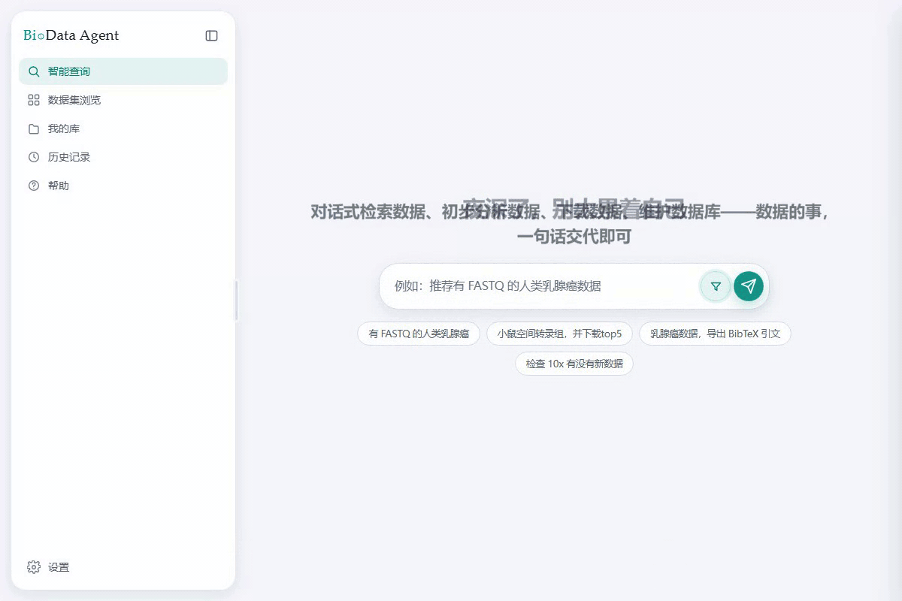
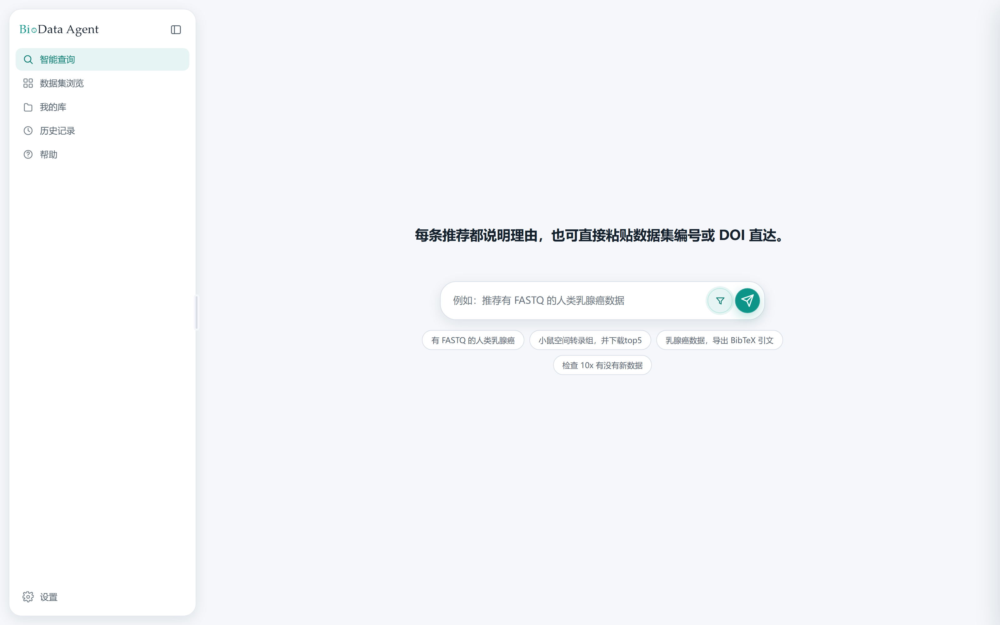
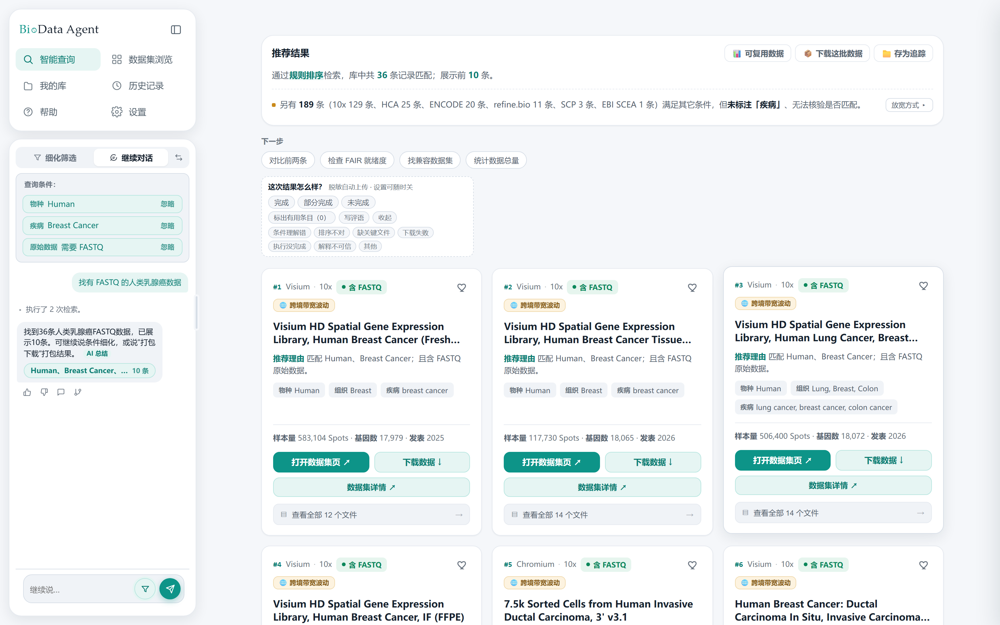
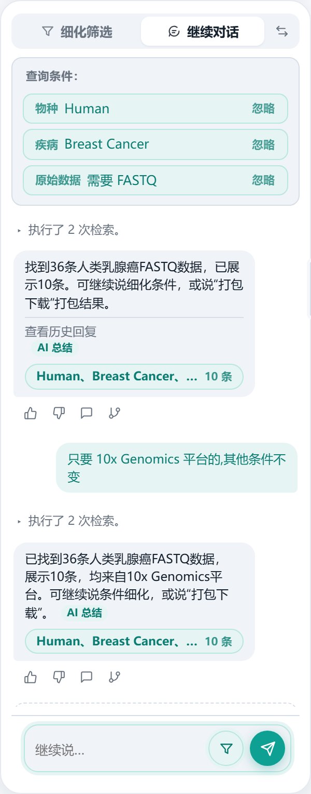
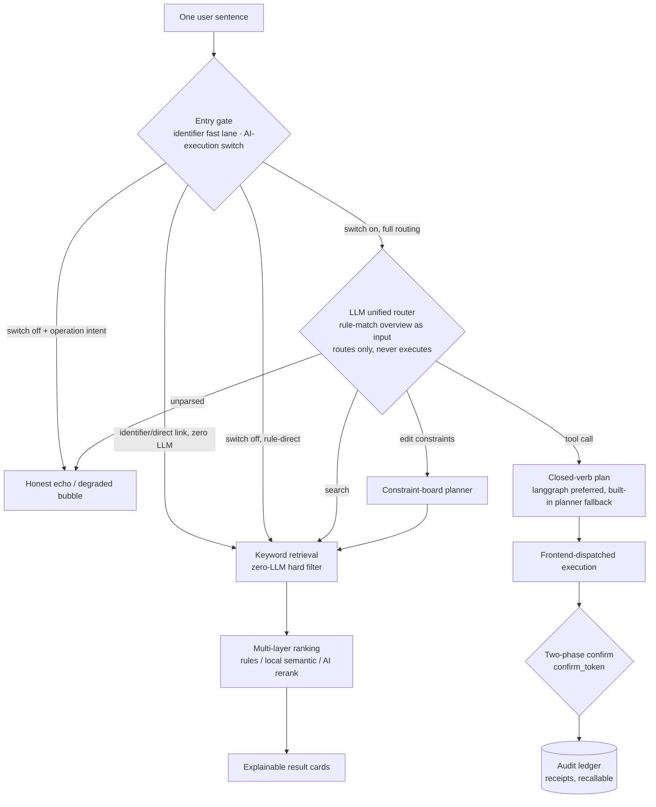

# BioData Agent

[](https://github.com/hty8870/biodata-agent/actions/workflows/ci.yml)
[](LICENSE)
[](requirements/requirements.txt)

[中文](README.md) · **English**

A **conversational dataset-discovery agent** for public single-cell and spatial omics catalogs. Describe your experiment in one sentence; the system hard-filters, transparently ranks, and organizes citations and downloads across 8,022 public metadata records. A **ReAct execution loop** sits around a **RAG retrieval core**: deterministic retrieval is offline and token-free by default, while local vectors and LLMs are optional enhancements. The tool surface is scoped to the task, independent read-only calls may be safely batched, and every call retains its execution context, evidence, and receipt, so the session is **auditable and reversible**.



> Note: the product UI and query language are Chinese-first; all interfaces, docs and error messages are localized for Chinese researchers. This README describes the same build.

## Why BioData Agent

### Low latency: the default path never touches an LLM

- Rule-based retrieval is fully deterministic, offline, and key-free — measured at ~24ms end-to-end on a local machine, with the conversation router's keyword stage at p50=16ms (n=30).
- Full-catalog API (8,022 records): 0.87MB gzipped (10.9%), 17ms median on cache hits, ~22ms for ETag 304s.
- Cold start to health check ≈ 1.1s; corpora and indexes are lazy-loaded with zero I/O at import time.
- Local vector recall/rerank is opt-in: weights are pre-downloaded and never phone home. AI rerank, recommendation polishing, and AI execution are optional enhancements that degrade honestly and say so — behavior never changes silently.

> Latency figures are single-machine measurements for relative verification, not cross-hardware SLAs.

### Security: writes are the exception, not the rule

- Only 3 of the 19 MCP tools can write to disk, and all of them are **two-phase**: the plan phase writes nothing and returns a preview plus a `confirm_token` (sha256 of action parameters + content fingerprint); a mismatched token means not a single byte is written.
- The frozen evaluation corpus is structurally read-only: uploads, downloads, and traces are anchored to the external library and user-data directories; `database/base/` is unreachable.
- The download channel is SSRF-hardened end to end: https + domain allowlist, re-validation on every redirect hop, connections pinned to the validated IP (anti-DNS-rebinding), loopback/private/cloud-metadata addresses rejected (169.254.169.254 etc.), max 3 hops, and a streaming hard byte cap.
- API keys live in session memory by default; persisting them requires two explicit opt-ins. Custom LLM endpoints pass the same IP validation and never inherit server-side shared keys.
- Accounts use scrypt with per-user random salts, constant-time comparison, anti-enumeration and timing-side-channel defenses, and short-term lockout. Online-MCP Bearer tokens are stored as sha256 digests only (a database leak leaks no usable credential), and token holders **cannot burn the server's LLM budget** (a contextvar-level cost gate).
- The deployment posture is documented honestly in [SECURITY.md](SECURITY.md): the loopback default is not production-ready, and the telemetry ingest endpoint is a documented plaintext-HTTP risk acceptance — harden per its checklist before public exposure.

### Auditable: every call leaves a complete scene

- Every tool call is recorded with its full execution info and context in an append-only trace ledger (sequential JSONL, serializability validated at entry).
- A network-request ledger (including failures and retry counts), operation receipts, redacted MCP call logs (`.userdata/mcp_calls.jsonl`), and a retrieval policy fingerprint returned with every response.
- Telemetry is local-first: behavior records stay on the machine by default; upload requires both a switch and per-account explicit consent; content fields (query text, tracker names) structurally never enter telemetry.

### Reversible: every write has an undo

- Deletion moves files to a **recycle bin** (restorable), not erasure; rollback itself goes through the recycle bin, and anything without a preimage is fail-closed refused.
- Sync operations are **atomic-recallable**: one `operation_id` rolls back every write of that run, with recycle-bin semantics, re-entrancy, and honest status.
- Preview-before-confirm and `dry_run` throughout; downloads write `.part` then atomically rename, and failed verification leaves a `.corrupt` evidence file instead of overwriting.
- No LLM / no local model / no network: the system falls back to the rule path and labels the source honestly; when nothing matches it suggests how to relax the query instead of padding results with records that violate hard constraints.

### Retrieval quality: verifiable, not claimed

| Evaluation | Size | Top1 | Top5 | Hard-constraint violations | Notes |
|---|---:|---:|---:|---:|---|
| Frozen main set (the only release gate) | 54 queries | 97.7% | 97.7% | 0 | 0 FASTQ violations; 10/10 correct no-result abstentions |
| Blind-built holdout (generalization watchdog) | 50 queries | 97.8% | 97.8% | 0 | Built without ever seeing the retrieval implementation or main-set items |

- Trajectory (every step a controlled re-baseline on record): Top1 71.8% → 97.7%, Top5 79.5% → 97.7%, hard violations 37.7% → 0.
- The discipline is the product: a SHA-256 fingerprint lock on the frozen corpus (CRLF/LF immune); thresholds may only tighten — loosening one requires recorded authorization. The private holdout is single-use and unpublished. Public users can reproduce the frozen, dev, and independent public-validation gates offline; the historical holdout number is explicitly private evidence, not a public reproducibility claim.

### Engineering credibility

- Policy requires the current suite to pass in full; it does not hand-maintain a passed count that drifts on every commit. CI retains a machine-readable report for the exact revision.
- Public full has 11 manifest-driven gates: dependency consistency, the full suite, project/Web/MCP smoke tests, frozen + dev evaluation, and installer contracts. Private adds governance and the unpublished holdout for 13 gates.
- CI runs a three-leg matrix (Windows full gate + Ubuntu fast gate on two Python versions), first-launch smoke tests of the source package on three platforms, and a delivery-surface contamination scan that blocks internal material at the source.

## Interface

| Smart query | Search results | Follow-up chat |
|---|---|---|
|  |  |  |

## Architecture at a glance



Both sides share the same corpora (frozen baseline + external library) and the same deterministic generators; any unavailable AI component degrades honestly. With the switch on and no action marker in the sentence, a preliminary retrieval runs concurrently with LLM routing — reused on a search verdict, discarded on a tool-call verdict — so routing never waits on retrieval.

## Quick start

### Windows: double-click

1. Make sure Python 3.10+ is installed.
2. Double-click `打开前端.bat` (or `start-web.bat`) in the project root.
3. On first run the script prepares a project-local `.venv`, installs runtime dependencies on demand, and opens the browser; it never silently borrows a development or MCP environment.
4. The page defaults to <http://127.0.0.1:7860>.

> Clone layout note: inside delivery/portable packages the launch scripts and requirement files stay at the package root (legacy layout). In a **repository clone**, launch scripts live in `launchers/`, requirement files in `requirements/`, and the MCP entry point is `src/dataset_recommender/app/mcp_server.py`. The quick-start section is written for package users with in-package paths; the development sections below use clone paths.

The first dependency install needs the network; later runs reuse the project `.venv`. To share an interpreter, set `BIODATA_PYTHON` explicitly; to change the port temporarily, `$env:PORT = '7861'`.

### macOS / Linux: one command

```bash
sh 打开前端.sh        # Linux / generic; on macOS you can also double-click 打开前端.command
```

First run prepares and reuses the in-project `.venv`, installs dependencies on demand, asks three optional questions in English (all skippable with Enter), then opens the browser; a busy port auto-drifts to 7861-7869. If macOS warns about an unidentified developer, right-click → Open, or run `chmod +x 打开前端.command` first.

### Manual start

```powershell
# Windows PowerShell (on macOS/Linux use python3 and ./.venv/bin/python)
python -m venv .venv
.\.venv\Scripts\python.exe -m pip install -r requirements\requirements.txt
.\.venv\Scripts\python.exe scripts\run_web.py --open
```

### Desktop window mode (optional)

For a native-app feel (standalone window, no browser chrome):

```powershell
.\.venv\Scripts\python.exe -m pip install -r requirements\requirements-webview.txt   # once (pywebview 5.4)
.\.venv\Scripts\python.exe scripts\run_app.py                          # native window; closing it exits
```

The window's colors, size, and icon match the app; external links open in the system browser; if the shell is unavailable (missing pywebview, missing WebView2, window creation failure) it degrades gracefully to the system browser + tray — never a white screen. The Inno-packaged `BioDataAgent.exe` installer defaults to window mode; double-clicking the bare exe still uses browser + tray as a recovery channel. Set `BIODATA_SHELL_DEBUG=1` to open DevTools inside the window.

### Platform support

| Platform | Form | Notes |
|---|---|---|
| Windows | Desktop window app (WebView2) + installer; browser access also works | Double-click `start-web.bat` or the installed app; the desktop form includes tray, single instance, and local notifications |
| macOS / Linux | Serve from source + any modern browser | The same web UI with full feature parity; no native window, installer, or tray |

Accounts and local data (favorites, history, uploads) stay on each machine and do not sync across devices.

#### Corporate proxy environments

Behind a mandatory egress proxy: LLM calls, dataset curation (online search), and telemetry upload honor the standard `HTTP_PROXY`/`HTTPS_PROXY` variables; **the download executor pins target IPs and bypasses the proxy by design (SSRF defense)** — on networks where only the proxy can reach the internet, server-side downloads will fail as expected; run the generated download script on a machine with direct access instead.

### Web edition (Docker deployment)

A server-deployable web edition with accounts, invite-code registration, online MCP tokens, and a telemetry receiver lives in `deploy/web/` (compose + deploy scripts, with a templated README for self-hosting).

## Feature map

- **Conversational database curation**: one sentence to inventory / import local JSON (content-hash dedup) / search official sources online / recycle-bin delete / restore / check and sync upstream updates. Curation only ever touches your own `upload_*` files; every write is two-phase confirmed and atomically recallable. With "AI execution" on (the default), action requests are carried out for you, each step written to the local audit ledger; installing the langchain extension (`requirements/requirements-langchain.txt`) hands execution to a langgraph-orchestrated agent, and without it (or without an LLM) the built-in planner takes over with identical capabilities.
- **Unified download lane**: every browser download (real data files / citations / task packs / exports) goes through a single download queue with an honest state machine ("handed to the browser" means exactly that); the panel supports appending and cancelling un-fired items.
- **One-sentence task pack**: one search → result manifest + download script + FAIR self-check + citations, previewed first and built only after confirmation.
- **FAIR reuse-readiness check**: 13 F/A/I/R checks plus a submission-ready English reuse statement — deterministic, offline, no LLM.
- **Citations in three formats**: RIS / BibTeX / GB/T 7714-2015 [DS/OL] dataset records; missing fields are listed as gaps, never fabricated.
- **Tracking and update checks**: pin a search session as a "tracker" (stored only in your browser); "check for updates" deterministically re-runs the original constraints and new hits land in "pending verification", never auto-included; the export center produces inclusion/exclusion tables and research material packs.
- **Accounts and memory**: registration/login, 30-day sessions, invite-code mode (hardened deployments), per-account daily LLM quotas (BYOK unmetered); "user memories" are saved manually, deletable one by one, and never auto-appended to queries; "consolidate memories" runs the LLM inside a closed guardrail with verbatim provenance checks (≥2 distinct conversations), writes only what you tick, and is always labeled "AI-organized". The server also offers an opt-in Redis session backend and an RQ job-queue backend (both off by default; see deploy/web/README.md §10).
- **Usage feedback**: local collection is on by default (messages, results, latency, errors, ratings) and never collects API keys, passwords, or account names; upload happens only if the deployer configured a secure telemetry channel — with the default empty configuration everything stays local, exportable, closable, and clearable at any time.

## Basic workflow

1. Type your experimental need into "Smart query", e.g.:
   - `推荐近三年 CELLxGENE 中的人类肝脏单细胞数据`
   - `找有 FASTQ 的小鼠脑 scRNA-seq 数据`
   - `2015 年以来的人类乳腺癌数据，不要空间转录组`
2. Leave "data source" and "publication date" on auto-detect and the system extracts the constraints from your sentence; expand them to pick manually.
3. Read the search summary above the results: which constraints were recognized, which ranking layers ran, how many records matched in the library, and whether any layer degraded to a basic mode.
4. Open a result card for source, match rationale, page links, and file manifests; "dataset details" opens the dataset's detail page in a new tab.

A 14-step tutorial appears on first visit — draggable, skippable, and replayable from "Help". Step 5 opens the real API configuration form; skip it if you like, basic retrieval keeps working.

## Ranking strategies

- **Rule ranking**: always on. Hard-constraint filtering first, then deterministic rule ranking.
- **Local precision rerank**: a local semantic model reorders candidates; no API key needed; falls back to rule ranking when the model is not installed.
- **AI rerank**: calls the configured LLM to reorder candidates that passed hard filtering; needs network and an API key.
- **AI recommendation polishing**: improves wording only — never data or order.

"Auto-select ranking strategy" is on by default, stacking local or AI rerank based on query complexity; rule ranking is always kept. AI and local semantic rerank only reorder candidates — explicit species, tissue, disease, technology, date, and raw-data constraints are always enforced by rule filtering.

## Data coverage

The built-in corpus currently holds 8,022 public dataset metadata records; uploads increase the total.

| Source | Records |
|---|---:|
| 10x Genomics | 784 |
| CELLxGENE Discover | 2,198 |
| ArrayExpress | 1,784 |
| HuBMAP | 1,016 |
| Broad Single Cell Portal | 830 |
| Human Cell Atlas | 532 |
| EBI Single Cell Expression Atlas | 384 |
| refine.bio | 300 |
| Zenodo | 94 |
| NCBI GEO | 60 |
| ENCODE | 40 |

Data lives in two layers: `database/base/` is the shipped 10x Genomics frozen baseline (stable retrieval and evaluation, SHA-256 fingerprint-locked); `database/external/` holds snapshots of other public sources plus your uploads, and only participates when its source is explicitly selected.

The project processes dataset metadata (title, species, tissue, disease, technology, publication date, public URLs, file manifests) — no biological sequences, no private clinical raw data, no wet-lab protocols.

## Upload your own datasets

In the web UI, open "Dataset browser" and upload a UTF-8 JSON file at the top. Uploads only land in `database/external/` and never overwrite the base library; they are browsable and searchable without a restart. Minimal example:

```json
[
  {
    "dataset_name": "Human lung single-cell atlas",
    "species": "Human",
    "tissue": "lung"
  }
]
```

Full field list, source precedence, batch format, and deletion: see the upload specification (Chinese) at `使用教程/数据集上传/数据集上传规范.md`.

## API & LLM configuration

Rule retrieval and any installed local semantic model work without any API configuration. In the web UI: open "Settings" → "AI / API configuration" → pick DeepSeek, Kimi, Qwen, GLM, OpenRouter, or OpenAI (official compatible endpoints and recommended models are pre-filled), use "compatible endpoint" for unlisted providers, or "local model" for self-hosted ones.

API keys live in the current page session by default; only when both "remember non-sensitive settings" and "also remember API key" are on does the key enter the browser's local storage. Legacy keys stored without this independent consent are wiped automatically when settings load. Never save personal keys on shared computers.

The server side can also use a local `.env` at the project root (copy `.env.example`; `.env` is git-ignored). Precedence: process environment variables, the file pointed to by `BIODATA_LLM_ENV_FILE`, project `.env` or `.env.zhipu`, then program defaults. For MCP scenarios an out-of-repo key file is recommended — see the MCP tutorial (Chinese) at `使用教程/MCP安装/MCP_安装教程.md`.

## Local semantic models

Local precision rerank needs extra model weights that are not distributed with the package. The installer offers an optional "local model" task (unchecked by default); from source, install manually:

```powershell
$Python = '.\.venv\Scripts\python.exe'   # macOS/Linux: ./.venv/bin/python
& $Python -m pip install -r requirements\requirements-embeddings.txt
& $Python scripts\fetch_embedding_model.py
```

A missing model never blocks startup — the system falls back to rule ranking.

## Command line

```powershell
$Python = '.\.venv\Scripts\python.exe'   # macOS/Linux: ./.venv/bin/python
& $Python src\dataset_recommender\app\cli.py --query '推荐有 FASTQ 的人类乳腺癌数据' --strategy auto --no-llm --show-pipeline
```

Common flags: `--top-k N`, `--strategy fixed|auto`, `--recall off|cross_encoder|dense`, `--rerank off|llm`, `--rerank-top-n N`, `--rerank-audit`, `--use-llm` / `--no-llm`, `--show-pipeline`, `--output-file PATH`. See `--help` for the full list.

## MCP integration

The project exposes 19 stdio MCP tools (16 read-only + 3 writing) for Codex, Claude Code, or any compatible client:

| Tool | Purpose |
|---|---|
| `recommend_datasets` | Recommend datasets from a Chinese natural-language query (optional facet refinement, constraint relaxation, time range) |
| `browse_datasets` | Browse the catalog by source/species/platform/year — no query sentence needed |
| `get_file_manifest` | File manifest of a dataset (names, sizes, md5, direct download URLs) |
| `get_dataset_introduction` | Structured introduction of a dataset (same source as the web detail page's intro tab) |
| `assess_dataset_fair` | Reuse-readiness check for a dataset + an English "reusing public data" statement |
| `build_reuse_pack` | Turn N reused public datasets into submission material (English paragraph + dataset list + items to verify + RIS/BibTeX export) |
| `lookup_identifier` | Exact identifier lookup (UUID / E-XXXX-N / DOI hit records directly; GEO/SRA accessions are honestly reported as outside this catalog, with a pointer to the source repository) |
| `find_compatible_datasets` | Find same-species, chemistry/platform-compatible datasets for a given one ("metadata-compatible" only — not an "integratable" claim) |
| `assess_feasibility` | Research question → feasibility overview (candidate count + lower bound of total cells + species/platform/year/source distribution + downloadable rate + gaps) |
| `plan_query_edit` | Plan the next constraint edit: "switch to mouse / add: must have FASTQ / drop the tissue limit" → one concrete change (plan only, no retrieval) |
| `plan_action` | What does this sentence ask for: normalize "pack the top 5" / "save it as an archive for me" into one action from a closed verb table (plan only, no execution; the evidence is guaranteed to be a literal substring of the original sentence) |
| `build_task_pack` | One-sentence task pack: one search → result manifest + download script + FAIR self-check + citations (preview first, build after confirmation) |
| `verify_local_assets` | Scan a local directory against the 10x file manifest (md5/size/name) into an asset ledger (md5 only — file contents are never read) |
| `provision_dataset` | Actually download dataset files into a caller-specified directory (https + allowlist, md5/size verification, `.corrupt` evidence on failure; main files only by default, `dry_run` previews; writes only when `dest_dir` is given, never into `database/`) |
| `curate_datasets` | Conversational database curation: inventory / local import (content dedup) / online search of official sources / recycle-bin delete / restore / check upstream updates / sync updates (scoped to `upload_*` files in the external library; preview → confirm_token → apply, zero writes on token mismatch; sync returns an operation receipt and is atomically recallable) |
| `parse_constraints` | Parse the query sentence without retrieving (see what the system understood) |
| `upload_dataset` | Ingest your own dataset metadata into the external library, instantly searchable (writes `database/external/`; together with `provision_dataset` and `curate_datasets`, one of only three writing tools) |
| `biodata_status` | Service and corpus status |
| `biodata_llm_status` | LLM configuration status (reads config only, no network) |

Every candidate from `recommend_datasets` carries a compatible `introduction` field, generated by the same deterministic generator as the web detail page's intro tab.

The web edition also offers **online MCP**: the same instance in streamable-HTTP form mounted at `/mcp`, gated by Bearer tokens (sha256 digests only, max 5 per account) plus a deterministic cost gate (token holders cannot consume the server's LLM quota).

### Conversational curation (curate_datasets)

`curate_datasets` manages **your own uploads** in one sentence: `action=list` inventories the external library and recycle bin, `import` imports local dataset JSON (content-hash dedup; duplicates rejected by default, `force=true` overwrites), `search_online` searches official sources (candidates previewed first, ingested only after confirmation), `remove` moves files to the recycle bin (reversible), `restore` brings them back, `check_updates` checks official sources for updates, `sync_updates` syncs them into the external library (returns an operation receipt, atomically recallable). All writes are **two-phase**: by default only a preview and `confirm_token` are returned (nothing on disk); sending the token back executes; a token that mismatches the content fingerprint writes not a single byte. The scope is limited to `upload_*` files in `database/external/`; official snapshots and the frozen baseline `database/base/` are structurally unreachable. The web endpoints are `POST /api/curate/plan`, `/api/curate/apply`, `/api/curate/sync-updates` (plus read-only `/api/curate/sync-status` and atomic recall `/api/curate/recall`); the CLI is `scripts/curate_datasets.py` — all three share one implementation.

The web edition also provides a unified conversation router, `POST /api/utterance`: every input passes the entry gate first — a sentence pasting an identifier or direct link goes straight to retrieval with zero LLM; with "AI execution" off, all input is handled as rule-based search (sentences whose operation intent is rule-detected get a degraded bubble instead of being silently treated as search); with it on, every sentence goes through LLM unified routing (the rule-match overview feeds the routing decision; the langgraph graph is preferred and the built-in planner takes over when the extension or LLM is unavailable), routing only, never executing — a search or constraint-edit verdict yields a rewritten query handed to `/api/recommend`, a tool-call verdict yields only a closed-verb plan for the frontend to confirm and execute, and anything unparsed gets an honest echo.

Every MCP tool call appends one redacted JSON line to `.userdata/mcp_calls.jsonl` on the local machine (no network, no database); set `BIODATA_MCP_CALL_LOG=off` in the MCP client's env to disable, and use `scripts/summarize_mcp_calls.py` for statistics. On Windows, `scripts\setup_mcp.ps1` handles the dedicated environment, protocol self-check, API configuration, client registration, and read-back verification. Full steps: see the MCP tutorial (Chinese) at `使用教程/MCP安装/MCP_安装教程.md`.

## Optional: execution-side agent extension (langchain/langgraph)

"Tool call / database curation" instructions are handled by the built-in planner by default — **no extension required**. With the langchain extension installed, planning is taken over by a langgraph-orchestrated agent (tool-call protocol + self-correction + bounded multi-step execution):

```bash
pip install -r requirements/requirements-langchain.txt
```

Without the extension or an LLM, the system falls back to the built-in planner automatically; `BIODATA_AGENT_EXEC=off` forces the built-in planner. Turning off "AI execution" in settings makes every input a rule-based search — action sentences get only an explanation and directions, with nothing executed.

## Development & testing

Environment, architecture, HTTP endpoints, extension points, and the verification matrix for developers: see [DEVELOPMENT.md](DEVELOPMENT.md). The current Web API version is `3.0.0`. Manifest-driven unified quality gates are the preferred path for development and delivery:

```powershell
$Python = '.\.venv\Scripts\python.exe'
& $Python scripts\quality_gate.py --list
& $Python scripts\quality_gate.py --profile fast
& $Python scripts\quality_gate.py --profile full --report-json artifacts\quality-full-local.json
```

`fast` runs quick syntax and automation-contract checks; `full` adds dependency consistency, governance checks, the entire pytest suite, project/Web/MCP smoke tests, and the frozen recommendation evaluations. The runner strips secret/injection environment variables, disables model downloads, and constrains gated checks with an offline environment and network tripwires. Common checks can also run standalone:

```powershell
& $Python -m pytest tests\ -q
& $Python scripts\smoke_test.py
& $Python scripts\web_smoke_test.py
```

The MCP self-check must use the MCP-dedicated Python created by the installation tutorial (`%LOCALAPPDATA%\BioDataAgent\mcp-venv`), not the project `.venv` with only base dependencies. Hash-pinned CI environments, GitHub workflows, candidate ZIP builds, out-of-repo unpack re-verification, and rollback-evidence requirements: see [Automation & Release](docs/AUTOMATION_AND_RELEASE.md).

## Repository layout

```text
biodata-agent/
├─ launchers/                     GUI entries: 打开前端.bat/.command/.sh, start-web.bat, shortcut creator
│                                 (still at the package root in delivery/portable packages, legacy layout)
├─ README.md / README_EN.md       This file (Chinese / English)
├─ DEVELOPMENT.md                 For developers: architecture, interfaces, verification
├─ MODULES.md                     Detailed module and interface contracts
├─ SECURITY.md                    Key and data-handling conventions
├─ requirements/                  Dependency manifests: requirements.txt (minimal runtime) + CI/optional lists and locks
├─ 使用教程/                      Tutorials (Chinese): MCP, skills, dataset upload specification
├─ src/dataset_recommender/       Backend: query parsing, retrieval, ranking, interfaces
│  └─ app/mcp_server.py           MCP entry point for AI assistants
├─ web/static/                    Frontend: pages, styles, scripts
├─ database/base/                 Shipped frozen baseline catalog (read-only, SHA-256 fingerprint-locked)
├─ database/external/             Other public sources and your uploads
├─ scripts/                       Launch, quality gates, evaluation, packaging, smoke tests
├─ tests/                         Automated tests
├─ eval/                          Evaluation queries and baselines (frozen-eval inputs; holdout unpublished)
├─ automation/                    Quality-gate manifests, shared by local and CI
├─ docs/                          Engineering docs such as the release process (incl. acceptance notes)
├─ deploy/web/                    Web-edition Docker deployment (accounts + online MCP)
├─ .agents/skills/                Behavior packs installable into AI assistants
└─ .github/workflows/             CI and release-candidate workflow definitions
```

## Usage boundaries

- Recommendations depend on the current metadata snapshot. Source pages and download links may have changed since.
- `md5sum` verifies transfer integrity; it is not a security proof against malicious tampering.
- Field completeness varies across sources; unknown fields are never auto-treated as satisfying or violating a constraint.
- AI and local semantic rerank only reorder candidates; explicit species, tissue, disease, technology, date, and raw-data constraints are always enforced by rule filtering.
- On no match, ambiguity, or unreliable parsing, the system may ask for clarification or return no results — it never pads results with records that fail hard constraints.
- The corpus is a dataset **inventory**, not a literature library — "no match in this catalog" only means these sources hold no reusable dataset for the query; it says nothing about the state of research.
